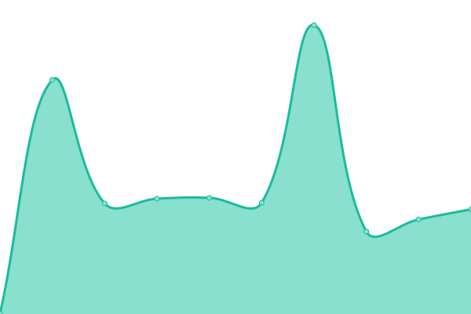
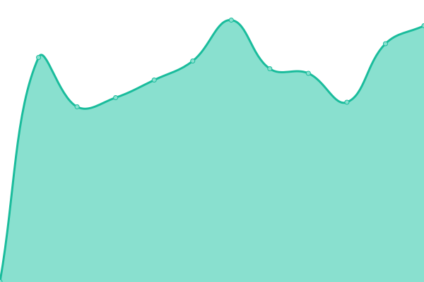
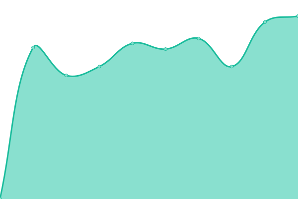

# [📈 Live Status](https://ies-italia.it): <!--live status--> **🟩 All systems operational**

This repository contains the open-source uptime monitor and status page for [IES Italia](https://ies-italia.it), powered by [Upptime](https://github.com/upptime/upptime).

With [Upptime](https://upptime.js.org), you can get your own unlimited and free uptime monitor and status page, powered entirely by a GitHub repository. We use [Issues](https://github.com/iesitalia/status-check/issues) as incident reports, [Actions](https://github.com/iesitalia/status-check/actions) as uptime monitors, and [Pages](https://ies-italia.it) for the status page.

<!--start: status pages-->
<!-- This summary is generated by Upptime (https://github.com/upptime/upptime) -->
<!-- Do not edit this manually, your changes will be overwritten -->
<!-- prettier-ignore -->
| URL | Status | History | Response Time | Uptime |
| --- | ------ | ------- | ------------- | ------ |
|  [IES Italia](https://ies-italia.it) | 🟩 Up | [ies-italia.yml](https://github.com/iesitalia/status-check/commits/HEAD/history/ies-italia.yml) | 

 1020ms
     
 | 

<a href="https://iesitalia.github.io/status-check/history/ies-italia">98.11%</a>
    

|  [Seafy](https://seafy.com) | 🟩 Up | [seafy.yml](https://github.com/iesitalia/status-check/commits/HEAD/history/seafy.yml) | 

 725ms
     
 | 

<a href="https://iesitalia.github.io/status-check/history/seafy">95.35%</a>
    

|  Seafy API | 🟩 Up | [seafy-api.yml](https://github.com/iesitalia/status-check/commits/HEAD/history/seafy-api.yml) | 

 622ms
     
 | 

<a href="https://iesitalia.github.io/status-check/history/seafy-api">95.18%</a>
    

|  Seafy Dashboard | 🟩 Up | [seafy-dashboard.yml](https://github.com/iesitalia/status-check/commits/HEAD/history/seafy-dashboard.yml) | 

 766ms
     
 | 

<a href="https://iesitalia.github.io/status-check/history/seafy-dashboard">99.82%</a>
    

<!--end: status pages-->

[**Visit our status website →**](https://ies-italia.it)

## 📄 License

- Powered by: [Upptime](https://github.com/upptime/upptime)
- Data in the `./history` directory: [Open Database License](https://opendatacommons.org/licenses/odbl/1-0/)
